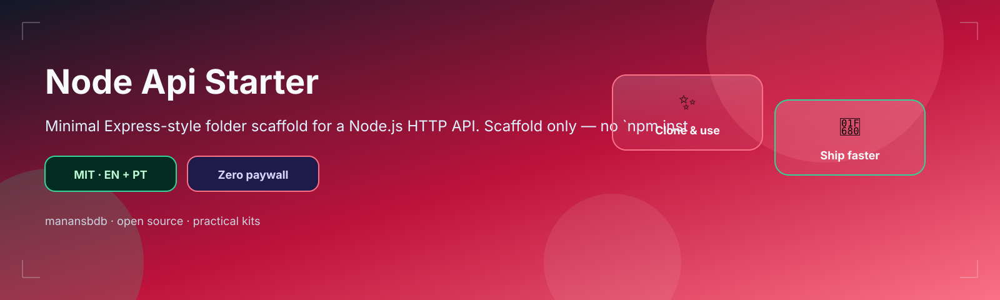
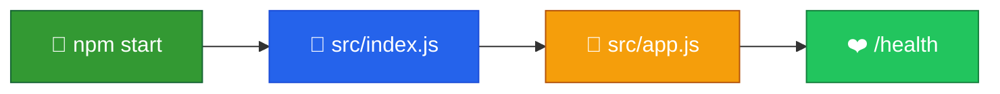

<p align="center">
  
</p>

<h1 align="center">node-api-starter</h1>

<p align="center">
  <strong>EN</strong> Minimal Express-style Node.js HTTP API scaffold<br/>
  <strong>PT</strong> Scaffold mínimo de API HTTP Node.js estilo Express
</p>

<p align="center">
  <a href="https://github.com/manansbdb/node-api-starter/blob/main/LICENSE"></a>
  
  
  <a href="#support--apoio"></a>
</p>

---

## What it does / Para que serve

| English | Português |
|---------|-----------|
| A **minimal Express API** scaffold with entrypoint, app factory, and a `/health` route. | Um scaffold de **API Express mínima** com entrypoint, app factory e rota `/health`. |
| Clone, `npm install`, `npm start` — or copy `src/` into a new project. | Clona, `npm install`, `npm start` — ou copia `src/` para um projeto novo. |



---

## Install / Instalação

### 1) Clone / Clona

```bash
git clone https://github.com/manansbdb/node-api-starter.git
cd node-api-starter
```

### 2) Install & run / Instala e corre

```bash
npm install
npm start
# or watch mode:
npm run dev
```

### 3) Copy scaffold / Copia o scaffold

```bash
cp -R src package.json /path/to/your-project/
cd /path/to/your-project && npm install
```

### Requirements / Requisitos

- Node.js 18+
- `npm`

---

## Quick start / Início rápido

```bash
git clone https://github.com/manansbdb/node-api-starter.git
cd node-api-starter
npm install && npm start
```

---

## Contents / Conteúdos

| Path | Purpose / Função |
|------|------------------|
| `package.json` | Scripts + Express dependency |
| `src/index.js` | Entrypoint |
| `src/app.js` | App factory |
| `src/routes/health.js` | Sample health route |
| `SUPPORT.md` | Donations / Doações |

---

## Project layout / Estrutura

```text
node-api-starter/
├── docs/banner.svg
├── package.json
├── src/index.js
├── src/app.js
├── src/routes/health.js
├── SUPPORT.md
└── README.md
```

---

## Support / Apoio

Bitcoin donations welcome / Doações em Bitcoin bem-vindas:

```
bc1q0qfnlnxyum9u45stzxe0a7jnhtj4j0usfkqdjw
```

See [SUPPORT.md](./SUPPORT.md).

---

## License / Licença

[MIT](./LICENSE) © 2026 manansbdb
